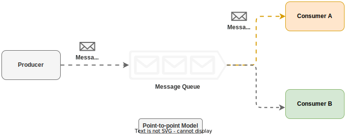
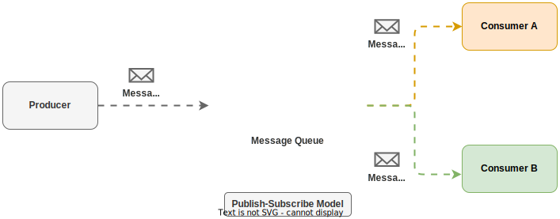

# Kafka Related Notes - March-2025

### Messagin Model

- <B>Point-to-Point</B>
    This model is commonly used in tradiotional message queues. In this model a message is sent to a queue and consumed by one and only once consumer. Multiple consumer can listen to the queus but each message can be consumed by only single consumer.

- <B>Publish-Subscribe</B>
    In this model messages are categorized based on TOPICS. Each topic has a name which is unique across the entire message queue service. In this model, messages are sent to a topic and received by the consumers who are listning to the topoc. 
    

